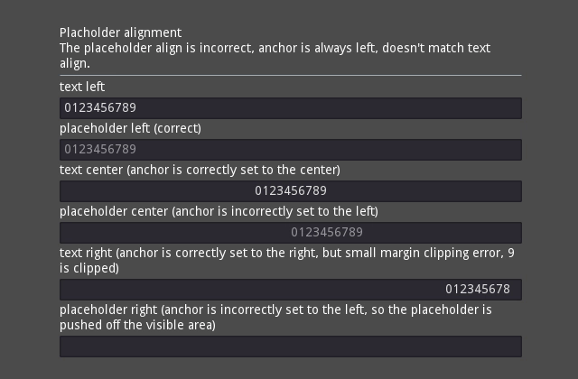
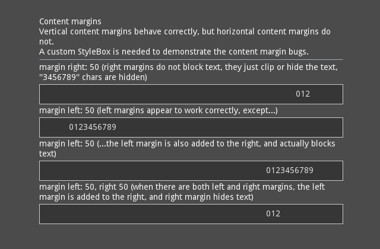
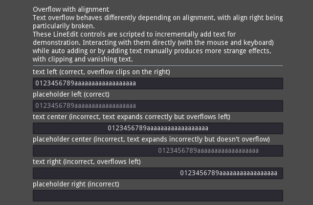
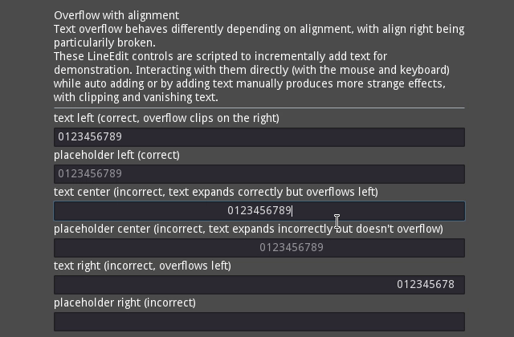

# LineEdit placeholder alignment, content margins, and overflow bugs

Godot 3.0.1

Arch Linux

OpenGL ES 3.0 Renderer: Mesa DRI Intel(R) HD Graphics 520 (Skylake GT2) 

LineEdit has multiple text layout bugs.

## Placeholder alignment

## Content margins

## Overflow with alignment

### Text added by script

### Text entered by keyboard

