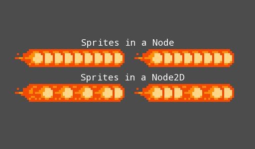

# Node2D children z-order shuffles when removing a child

Children of a `Node2D` shuffle their z-ordering when you start removing
children. This doesn't occur when the children belong to a `Node`
instead of `Node2D`.

